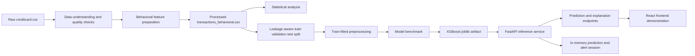

# BehaviorGuard

## Customer Behavioral Profiling for Credit Card Fraud Detection

BehaviorGuard is an academic and portfolio project that studies whether transaction-level behavioral features can add useful context to machine-learning fraud detection. It combines exploratory data analysis, behavioral feature engineering, statistical comparisons, supervised classification, threshold analysis, and SHAP-based explanations behind a small FastAPI service and React demonstration frontend.

The central contribution is **behavioral profiling + statistical analysis + ML-based fraud prediction + explainability**. The interactive frontend is the demonstration layer for those results; it is not the research contribution itself.

> **Scope note:** This repository uses the public, anonymized Credit Card Fraud Detection benchmark. The data does not contain customer identities, merchant categories, or personally interpretable transaction semantics. The behavioral features therefore describe transaction-history context and temporal/spending patterns in the available dataset; they do not demonstrate individualized customer profiling in a production banking setting.

## Project At A Glance

| Item | Result |
| --- | --- |
| Processed observations | 283,726 transactions |
| Processed columns | 39 |
| Fraud transactions | 473 |
| Fraud rate | 0.1667% |
| Model input features | 37 |
| Production model artifact | XGBoost pipeline |
| Saved decision threshold | 0.54 |
| Best saved PR-AUC | 0.8118, Random Forest |
| XGBoost test F1 | 0.8523 |
| API | FastAPI on port 8000 |
| Frontend | React + TypeScript + Vite on port 5173 |

## Problem Statement

Credit card fraud detection is a rare-event classification problem. A detector must identify a small number of fraudulent transactions without producing an operationally unmanageable number of false alerts. A single global classifier can learn useful patterns, but a probability alone does not explain how a transaction relates to its surrounding behavioral context.

This project asks:

1. What behavioral and transaction-context features can be derived from the available data?
2. Do fraudulent and legitimate transactions differ on those features statistically?
3. How do Logistic Regression, Random Forest, and XGBoost compare under severe class imbalance?
4. How does the operating threshold change the precision/recall/F1 tradeoff?
5. Can a model prediction be accompanied by local, human-readable feature contributions?

## Research And Engineering Scope

The project is intentionally a reproducible applied-ML study, not a claim of a production fraud platform.

### Core contribution

- Behavioral feature engineering for amount, time, and recent transaction activity.
- Statistical analysis that reports both significance and effect size.
- Imbalance-aware comparison of three supervised classifiers.
- Validation-based threshold selection for the deployed XGBoost pipeline.
- Local SHAP explanations grouped back to original input features.

### Demonstration layer

- FastAPI endpoints for health, model metadata, prediction, explanation, and session alerts.
- React frontend for model overview, behavioral evidence, performance analysis, transaction analysis, explanations, and investigation views.

## Dataset Description

The repository contains the commonly used public **Credit Card Fraud Detection** benchmark in:

```text
BehaviorGuard — Customer Behavioral Profiling for Credit Card Fraud Detection/
├── data/raw/creditcard.csv
└── data/processed/transactions_behavioral.csv
```

The raw file contains 284,807 transactions and 31 columns:

- `Time`: seconds elapsed from the first recorded transaction.
- `V1` through `V28`: anonymized PCA-transformed numerical features.
- `Amount`: transaction amount.
- `Class`: target label, where `1` is fraud and `0` is legitimate.

The processed analysis file contains 283,726 rows and 39 columns after the project processing and feature preparation steps. It includes the original model inputs plus derived temporal and behavioral fields. The processed target distribution is:

| Class | Count | Share |
| --- | ---: | ---: |
| Legitimate | 283,253 | 99.8333% |
| Fraud | 473 | 0.1667% |

Because `V1`-`V28` are anonymized, this project does not assign business meanings to individual PCA components. Interpretations focus on statistical separation and model contribution, not on claims such as a specific component representing a merchant or customer behavior.

## Data Preprocessing

The analysis workflow is documented in `notebooks/01_data_understanding.ipynb` and consolidated in `notebooks/04_final_analysis.ipynb`.

1. Load the raw CSV and inspect shape, schema, target balance, descriptive statistics, missing values, and duplicates.
2. Confirm the binary target convention: `Class = 1` is fraud and `Class = 0` is legitimate.
3. Preserve the processed dataset as `data/processed/transactions_behavioral.csv`.
4. Derive temporal context from `Time`, including hour-oriented analysis fields and `Time_Period`.
5. Exclude target and technical analysis columns from the model matrix.
6. Split data with stratification into approximately 64% training, 16% validation, and 20% test partitions using `random_state=42`.
7. Fit preprocessing only on the training data:
   - numerical features: median imputation followed by standardization;
   - categorical features: most-frequent imputation followed by one-hot encoding.
8. Use imbalance-aware model settings rather than relying on accuracy alone.

The processed analysis data has no missing values and no duplicate rows in the saved run. The split and preprocessing pipeline are designed to prevent test information from influencing transformations or threshold selection.

## Behavioral Feature Engineering

The final model uses 37 input features. Five are treated as behavioral features:

| Feature | Role |
| --- | --- |
| `Amount_Log` | Log-scaled transaction amount for a less skewed amount signal. |
| `Amount_Category` | Discrete amount band: `Zero`, `Low`, `Medium`, `High`, or `Very High`. |
| `Transactions_Last_1H` | Recent transaction count over a one-hour window. |
| `Transactions_Last_24H` | Recent transaction count over a 24-hour window. |
| `Amount_ZScore` | Standardized amount deviation used as a relative spending signal. |

The model also receives `Time`, `Amount`, `Hour`, `Time_Period`, and the anonymized `V1`-`V28` features. The API contract requires the complete processed feature row rather than accepting a small raw transaction object and silently inventing missing history.

The behavioral features are complementary signals. Their statistical association with fraud is not, by itself, evidence that any feature causes fraud. In a future customer-level system, these fields should be generated from history available strictly before the transaction under review.

## Statistical Analysis

Statistical work is documented in `notebooks/03_statistical_analysis.ipynb` and saved under `results/statistical_analysis/` and `results/final_analysis/`.

- Numerical variables are compared between legitimate and fraudulent transactions with Mann-Whitney U tests.
- Categorical relationships use chi-squared analysis where appropriate.
- Multiple comparisons are adjusted with the statsmodels multiple-testing utilities.
- Cliff's Delta is reported alongside adjusted p-values to communicate effect magnitude.
- Descriptive analyses include fraud rate by transaction hour and amount category.

The saved results show strong statistical separation for several anonymized `V` features. The engineered behavioral features are statistically associated with the label, but their saved effect sizes are small or negligible:

| Feature | Adjusted p-value | Cliff's Delta | Effect |
| --- | ---: | ---: | --- |
| `Amount_Log` | 0.000032 | -0.1115 | Negligible |
| `Transactions_Last_1H` | approximately 0 | -0.1543 | Small |
| `Transactions_Last_24H` | approximately 0 | -0.1461 | Negligible |
| `Amount_ZScore` | 0.000032 | -0.1115 | Negligible |

This distinction matters: a very small p-value is plausible with 283,726 observations, so practical magnitude is reported rather than significance being treated as predictive importance.

## Model Methodology

The final analysis in `notebooks/04_final_analysis.ipynb` compares:

- Logistic Regression with class balancing.
- Random Forest with class balancing.
- XGBoost with a training-derived positive-class weight.

The models use the same stratified train/validation/test protocol and the same train-fitted preprocessing design. Evaluation emphasizes precision, recall, F1, PR-AUC, ROC-AUC, balanced accuracy, and confusion matrices. PR-AUC is especially important because only 0.1667% of transactions are fraudulent.

The serialized production artifact is:

```text
BehaviorGuard — Customer Behavioral Profiling for Credit Card Fraud Detection/
└── results/final_analysis/models/xgboost.joblib
```

The API loads this existing pipeline at startup. It does not retrain the model during normal requests.

## Model Comparison

Saved test-set results from `results/final_analysis/model_benchmark.csv`:

| Model | Precision | Recall | F1 | PR-AUC | ROC-AUC |
| --- | ---: | ---: | ---: | ---: | ---: |
| Logistic Regression | 0.0507 | 0.8737 | 0.0958 | 0.6896 | 0.9694 |
| Random Forest | 0.9459 | 0.7368 | 0.8284 | 0.8118 | 0.9489 |
| XGBoost | 0.9259 | 0.7895 | 0.8523 | 0.8105 | 0.9662 |

Random Forest is the saved PR-AUC leader by a small margin. XGBoost has the highest saved F1 and recall among the practical tree-based detector choices and is the model selected for the API. This is an operating-point choice, not a claim that XGBoost dominates every metric.

## Threshold Selection

The model returns a fraud probability. The API converts that probability to a fraud decision using the validation-selected threshold `0.54`:

```text
fraud_probability >= 0.54  -> fraud
fraud_probability <  0.54  -> normal
```

The threshold was selected on validation data using the precision/recall/F1 tradeoff and then held fixed for final test evaluation. The test set was not used to choose the threshold. The saved threshold curve is available at `results/final_analysis/xgboost_threshold_analysis.csv`.

The frontend includes a threshold-analysis slider for inspection. It changes the displayed saved analysis point only; it does not mutate the API's production threshold.

## Explainable AI

BehaviorGuard uses SHAP `TreeExplainer` on the fitted XGBoost model. The implementation in `src/explainability.py`:

1. Transforms a processed input row with the fitted preprocessing pipeline.
2. Computes signed local SHAP contributions.
3. Groups transformed columns back to their original input features, including one-hot categorical groups.
4. Separates factors that move the prediction toward fraud from factors that reduce risk.
5. Returns top factors and an explicit note that contributions describe model behavior, not causality.

The repository also preserves global model-importance outputs in `results/final_analysis/xgboost_feature_importance.csv`. Global importance and local SHAP contributions answer different questions and should not be conflated.

## System Architecture



### End-to-end workflow

```text
Raw transactions
    -> quality checks and derived behavioral context
    -> statistical comparison of legitimate vs fraud groups
    -> stratified train/validation/test split
    -> train-fitted preprocessing and model benchmark
    -> validation threshold selection
    -> saved XGBoost pipeline
    -> API probability, risk decision, and SHAP factors
    -> frontend inspection and investigation views
```

## Frontend Features

The frontend is a React + TypeScript + Vite application in `frontend/`. It is a demonstration and inspection layer over the saved evidence and live API.

| View | Purpose |
| --- | --- |
| Overview | Shows dataset context, saved metrics, model status, behavioral evidence, and live API-session predictions/alerts. |
| Transaction analyzer | Sends the 37-feature demo payload to `/predict` and `/explain`, then displays probability, threshold, decision, risk score, and local factors. |
| Behavioral intelligence | Displays amount-category fraud rates, behavioral medians, adjusted statistical results, and the separation between statistical association and model contribution. |
| Model performance | Compares classifiers and exposes the saved threshold tradeoff without changing the deployed threshold. |
| Explainable AI | Presents global XGBoost importance and requests local SHAP factors for a processed transaction. |
| Investigation | Reads high-risk records from the API's lightweight in-memory session and displays live alert status. |

The UI intentionally labels saved aggregate results and live API data separately. There are no committed browser screenshots in the current repository; the views above are the reproducible frontend feature description, and the saved PNG figures provide visual evidence for the analysis itself.

### Analysis figures

Representative figures are preserved in:

- `results/final_analysis/figures/precision_recall_curves.png`
- `results/final_analysis/figures/xgboost_feature_importance.png`
- `results/final_analysis/figures/fraud_rate_by_hour.png`
- `results/statistical_analysis/figures/top_statistical_features.png`
- `results/statistical_analysis/figures/amount_category_fraud_rate.png`

## How To Run Locally

### Prerequisites

- Python 3.10 or newer.
- Node.js 18 or newer and npm.
- A working virtual environment for the Python dependencies.

### Install Python dependencies

From the repository root:

```bash
python3 -m venv .venv
source .venv/bin/activate
pip install -r requirements.txt
```

### Install frontend dependencies

```bash
cd frontend
npm install
cd ..
```

### Start the backend

Use a terminal from the repository root:

```bash
source .venv/bin/activate
cd "BehaviorGuard — Customer Behavioral Profiling for Credit Card Fraud Detection"
uvicorn api.main:app --reload --host 127.0.0.1 --port 8000
```

The API will be available at `http://127.0.0.1:8000`. OpenAPI documentation is available at `http://127.0.0.1:8000/docs`.

### Start the frontend

Use a second terminal:

```bash
cd frontend
npm run dev
```

Open `http://localhost:5173`. The frontend defaults to `http://127.0.0.1:8000` for the API. To use another API origin, create `frontend/.env` with:

```bash
VITE_API_BASE_URL=http://127.0.0.1:8000
```

The backend allows the local frontend origins `localhost:3000`, `localhost:5173`, `127.0.0.1:3000`, and `127.0.0.1:5173`. Override them with a comma-separated `BEHAVIORGUARD_CORS_ORIGINS` value if the frontend runs elsewhere.

### Run tests and build

Backend tests, from the nested application directory:

```bash
cd "BehaviorGuard — Customer Behavioral Profiling for Credit Card Fraud Detection"
source ../.venv/bin/activate
pytest
```

Frontend production build, from `frontend/`:

```bash
npm run build
```

## API Documentation

The service is implemented in `BehaviorGuard — Customer Behavioral Profiling for Credit Card Fraud Detection/api/main.py`.

| Method | Endpoint | Description |
| --- | --- | --- |
| `GET` | `/health` | Returns service status and whether the model is loaded. |
| `GET` | `/model-info` | Returns model name, version, feature count, and threshold. |
| `POST` | `/predict` | Scores one processed transaction and stores a summary in the API session. |
| `POST` | `/explain?top_n=5` | Scores one transaction and returns local SHAP factors. `top_n` is limited to 1-20. |
| `GET` | `/predictions?limit=20` | Returns recent prediction summaries from the current session. |
| `GET` | `/alerts?limit=20` | Returns high-risk predictions from the current session. |
| `GET` | `/transactions/{prediction_id}` | Returns a stored prediction summary and behavioral summary. |
| `PATCH` | `/alerts/{prediction_id}` | Updates alert status to `new`, `reviewing`, or `resolved`. |

`/predict` and `/explain` require the complete 37-feature processed input contract:

```text
Time, V1-V28, Amount, Hour, Time_Period, Amount_Log,
Amount_Category, Transactions_Last_1H, Transactions_Last_24H,
Amount_ZScore
```

Example request shape:

```json
{
  "Time": 0,
  "V1": -1.359807,
  "V2": -0.072781,
  "V3": 2.536347,
  "V4": 1.378155,
  "V5": -0.338321,
  "V6": 0.462388,
  "V7": 0.239599,
  "V8": 0.098698,
  "V9": 0.363787,
  "V10": 0.090794,
  "V11": -0.5516,
  "V12": -0.617801,
  "V13": -0.99139,
  "V14": -0.311169,
  "V15": 1.468177,
  "V16": -0.470401,
  "V17": 0.207971,
  "V18": 0.025791,
  "V19": 0.403993,
  "V20": 0.251412,
  "V21": -0.018307,
  "V22": 0.277838,
  "V23": -0.110474,
  "V24": 0.066928,
  "V25": 0.128539,
  "V26": -0.189115,
  "V27": 0.133558,
  "V28": -0.021053,
  "Amount": 149.62,
  "Hour": 0,
  "Time_Period": "Night",
  "Amount_Log": 5.01476,
  "Amount_Category": "Medium",
  "Transactions_Last_1H": 0,
  "Transactions_Last_24H": 0,
  "Amount_ZScore": 0.244199
}
```

Example response fields include `fraud_probability`, `risk_score`, `risk_level`, `decision`, `model_version`, `threshold`, and a generated `prediction_id`. The session endpoints store summary information in memory only; restarting the API clears it.

## Repository Structure

```text
BehaviorGuard/
├── Readme.md
├── requirements.txt
├── frontend/
│   ├── src/App.tsx
│   ├── src/components.tsx
│   ├── src/data/validatedData.ts
│   └── src/lib/api.ts
└── BehaviorGuard — Customer Behavioral Profiling for Credit Card Fraud Detection/
    ├── api/main.py
    ├── data/raw/creditcard.csv
    ├── data/processed/transactions_behavioral.csv
    ├── models/
    ├── notebooks/
    │   ├── 01_data_understanding.ipynb
    │   ├── 02_baseline_model.ipynb
    │   ├── 03_statistical_analysis.ipynb
    │   └── 04_final_analysis.ipynb
    ├── results/
    ├── src/
    │   ├── explainability.py
    │   └── predict.py
    └── tests/
```

## Limitations

- The benchmark is anonymized and does not provide customer IDs, merchant categories, account histories, or interpretable transaction narratives.
- The behavioral features are transaction-history context features, not a validated personalized customer profile.
- The target is extremely imbalanced, so measured performance can be sensitive to the split and operating threshold.
- Saved benchmark metrics are offline results from one evaluation design; they are not evidence of production performance or calibration.
- SHAP values explain the fitted model's contribution pattern. They do not establish causal reasons for fraud.
- The API accepts a fully processed row. A production feature service would need to construct and validate behavioral features from trusted historical data.
- Prediction and alert records are stored in an in-memory dictionary and disappear when the API restarts.
- The frontend contains saved aggregate analysis data for the research views; it is not a complete production monitoring console.
- No authentication, authorization, persistent database, rate limiting, drift monitoring, or audit trail is included.
- The project has not been validated against live financial workflows, regulatory requirements, or adversarial abuse.

## Future Work

The most valuable next steps are:

1. Acquire or construct a privacy-preserving dataset with stable customer identifiers and event timestamps.
2. Build a leakage-safe online feature service that computes customer baselines before scoring each transaction.
3. Evaluate temporal splits and out-of-time generalization rather than relying only on a random stratified split.
4. Calibrate probabilities and choose operating thresholds with an explicit false-alert cost model.
5. Add persistent storage, authentication, analyst audit history, and production monitoring to the API.
6. Measure drift in transaction, behavioral, and model-score distributions.
7. Test subgroup performance and fairness where legally and ethically appropriate.
8. Add browser screenshots and a deployment configuration after the application workflow is stable.

## Reproducibility And Evidence

The repository preserves the main analysis outputs rather than requiring a training run to view the portfolio results:

- `results/final_analysis/FINAL_PROJECT_SUMMARY.txt`
- `results/final_analysis/final_summary.json`
- `results/final_analysis/model_benchmark.csv`
- `results/final_analysis/xgboost_threshold_analysis.csv`
- `results/final_analysis/xgboost_feature_importance.csv`
- `results/statistical_analysis/final_statistical_evidence.csv`

The notebooks provide the analysis narrative and generated figures. The serialized XGBoost pipeline provides the API's repeatable inference artifact.

## Disclaimer

BehaviorGuard is an educational and research-oriented project. A model score is not proof of fraud. Any real financial deployment would require validated data pipelines, security controls, human review, monitoring, governance, and compliance with applicable law and institutional policy.